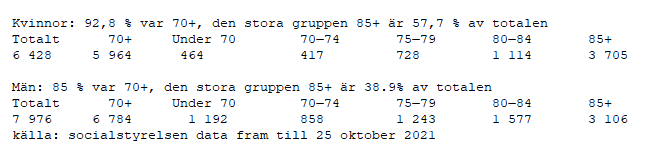

# Exploratativ dataanalys för KPI i uppgift 3 & 4

## Uppgift 3
### Antal avlidna per kön
#### Plot:  
task_3_totalt_antal_avlidna_per_kön.html  
#### Avlidna per kön
Kvinnor 45.2 %  
Män 54.7 %  
  
Folkhälsomyndighetens data inne håller inte data som anger kön och ålder. Så jag kollade i socialstyrelsens data för att förklara detta.
Fån 50 år ålder så ökar sannolikheten att män får covid jämfört med kvinnor, 3.9 % (man)  vs 1.7 % (kvinna).  
För att ligga närmare i åldrarna 75 -79. Över 85 års ålder så ökar andelen kvinnor markant.  
Detta då antalet kvinnor i den åldern är fler än männen. Är man under 50 så är risken att få covid under 1 % oavsett kön.  
Denna data var redan sammanställd hos socialstyrelsen så kod gjordes inte.  
Källor:  
https://www.socialstyrelsen.se/globalassets/sharepoint-dokument/dokument-webb/statistik/statistik-covid19-avlidna.xlsx  
Flik: Övergripande statistik
  
  
### Totalt antal smittade, IVA vård per åldersgrupp 
#### Plot:  
task_3_Totalt_antal_per_åldersgrupp.html  

Det är flest män som dött i covid19 i alla åldersgrupper, förutom i den som är 90 år och äldre.  
I den äldsta åldersgruppen var det fler kvinnor som dog, vilket kan förklaras med att det finns många fler kvinnor än män i den gruppen.
Andelen kvinnor som har högt blodtryck är något fler än män.  
Högt blodtryck är den vanligaste förekomsten av samsjuklighet för avlidna i covid‑19.  
Man har dock inte kunnat fastställa att det skulle vara en riskfaktor för att avlida i sjukdomen.  
Högt blodtryck är väldigt vanligt i den åldrade befolkningen och kan snarare antas spegla det.  
  
Majoriteten av de personer som dött i covid19 hade två eller flera av de sjukdommar som kan bidra till svårare symtom.  
Av de som avled med covid 19 som underliggande dödsorsak under fösta halvåret 2020 hade 78 % varit inskrivna på sjukhus någon gång under femårsperioden 2015‑2019.
 
Med underliggande dödsorsak menas den sjukdom eller skadehändelse som inledde den kedja av händelser som ledde till döden.  
Ett exempel på det är en 80-åring som dött med bekräftad covid‑19. På grund av covid‑19 fick 80-åringen lunginflammation som ledde till att hjärtat stannade.  
Eftersom det var covid‑19 som satte igång sjukdomsförloppet räknas det som den underliggande dödsorsaken. 

Från 70 års ålder ökar risken att dö, den ökar ännu mer i 80-90 års spannet, sedan minskar antalet dödsfall i 90+ år men det beror nog på antalet färre personer. 

Källor:  
https://www.socialstyrelsen.se/statistik-och-data/statistik/statistik-om-covid-19/statistik-over-antal-avlidna-i-covid-19/

### Antal covidfall och antal på IVA under tid
#### Plot:  
task_3_Antal_covid_och_iva_vårdade.html  
  
Kurvorna för antal smittade och antal IVA vårdade personer följs åt relativt bra.  
Inrapporteringar släpar och därmed ges toppar och dalar ibland trots att de inte finns i egentlig mening.  
I början 2020v04 provtogs bara de som vistats i områden med känd smittspridning.  
2020v11 ändrades provtagningen eftersom situationen förändrats i delar av Sverige.  
För att skydda de mest utsatta grupperna i samhället från smitta prioriteras sedan dess provtagning av personer som är i behov av vård på sjukhus samt personal inom vård och äldreomsorg med misstänkt covid-19. Vissa regioner har fortsatt med att smittspåra kontakter och därför provtagit en bredare grupp.  
Den 5 juni 2020 gav Regeringen uppdrag till Folkhälsomyndigheten och till länsstyrelserna att säkerställa flöden av storskalig testning. Kapaciteten ökas successivt och påverkar antalet fall som bekräftas, och andelen rapporterade fall som inte är behov av sjukhusvård kommer att öka.
Cirka 3 700 tidigare bekräftade covid-19 fall har tagits bort ur statistiken mellan den 27 augusti och den 2 september 2020 på grund av felaktigt positiva provsvar. Detta påverkar statistiken över anmälda fall från slutet av april fram till mitten av augusti.

### Antal avlidna per kön
#### Plot:  
task_3_totalt_iva_avlidna_per_sex.html  

| 
 
https://www.socialstyrelsen.se/globalassets/sharepoint-dokument/dokument-webb/statistik/statistik-covid19-70-ar-och-aldre.xlsx  
Filk: Smittade - insats - kön ålder  
https://www.socialstyrelsen.se/statistik-och-data/statistik/statistik-om-covid-19/statistik-om-covid-19-bland-aldre-efter-boendeform/

## Uppgift 4
### WHO
#### Plot: 
task_4_WHO_covid_kumulativ_per100000_above_500.html  
task_4_WHO_covid_deaths_kumulativ_per100000_between_200_to_500.html  
task_4_WHO_covid_kumulativ_per100000_below_200.html  
task_4_WHO_covid_kumulativ_per100000_below_100.html  

Det är många länder som inte rapporterar in någon data alls.  
En del länder har fler dödsfall än antal smittade jämfört med rikare länder.
Rent krasst är det svårt att göra en analys då datan inte är ok.   
Men Peru utmärker sig med förhållande smittade/döda. Länderna i EU ligger många över 200 döda per 100000. etc fortsätt här

### EU / EEA
#### Plot: 
task_4_vaccin_eu_eea.html  
task_4_eu_eea_procent.html  

Dos 1 vaccingeringsgrad  
4 länder ligger under 50% vaccineringsgrad: BG, HR, RO, SK
Ett land ligger under 30% vaccineringsgrad: BG (23%)  
Medel dos 1 i EU/EEA: 62,1%  
  
Dos 2 vaccineringsgrad
8 länder ligger under 50% vaccineringsgrad: BG, EE, HR, LV, PL, RO, SI, SK  
Ett land ligger under 30% vaccineringsgrad: BG (17%)  
Medel dos 2 i EU/EEA:  54,8%
